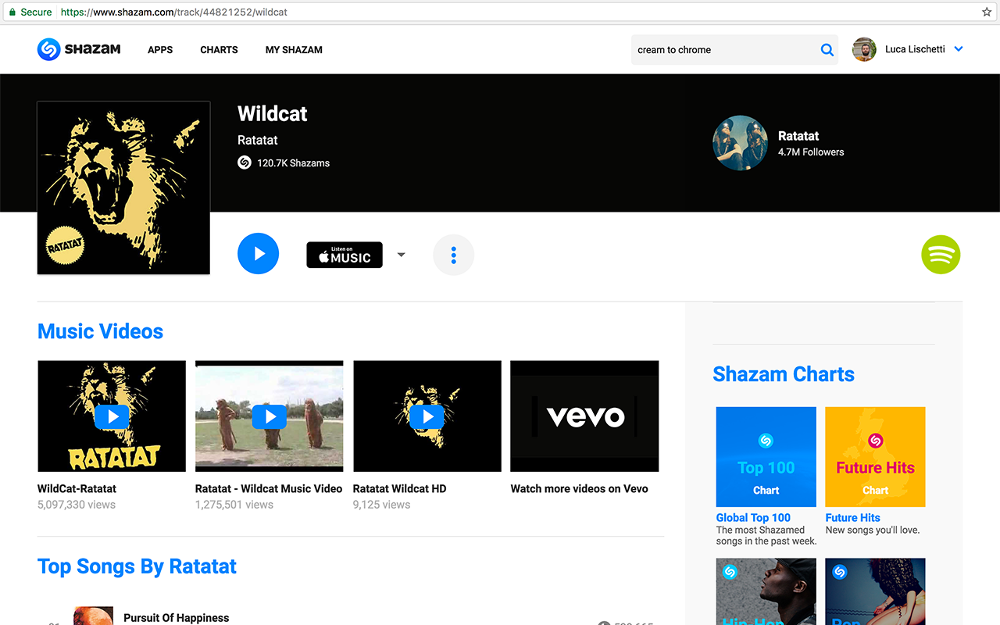

# Shazamify (a.k.a. Zamify)

Shazamify allows you to play your Shazams in Spotify, directly from the browser.

Shazamify add a small Spotify icon to every Shazam track page and allows you to play that track directly in Spotify.

## Chrome Extension

### [Link to the Webstore](https://chrome.google.com/webstore/detail/zamify/foilfgbdcipbajipeodmjjnkflkfocin/related)

## Note

**UPDATE 5**: I had to publish a new extension as the old one was costantly taken down with no explanation, thanks Google again 😒.

**UPDATE 4**: Since mid 2017 Spotify blocked unauthenticated API calls, unfortunately, because of that, the user scripts are not longer working :(

~~**UPDATE 3**</b>: The *Chrome Extension* was taken down without any notice from the store. Thanks Google, thanks! I am trying to figure out what I can do about it. In the meanwhile you can use the User Script solution.~~

~~**UPDATE 2**: The *Chrome Extension* is back only with a new fancy name (**Zamify**), thanks coypright!~~

~~**UPDATE**: Unfortunately the *Chrome Extension* was taken down from the store because it used the word Shazam. Anyway the good news is that you can still enjoying it with a manual installation :)~~

## Screenshot

